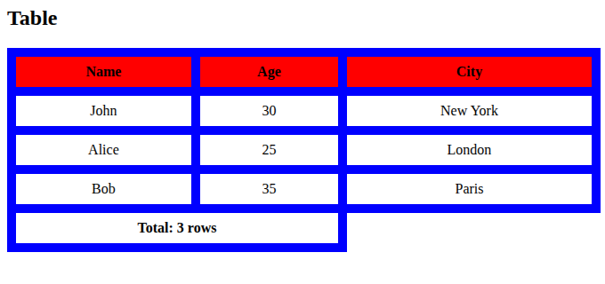

```html
<style>

    table {
        width: 100%;
        border-collapse: collapse;
    }

    th,
    td {
        border: 10px solid blue;
        padding: 8px;
        text-align: center;
    }

    th {
        background-color: red;
    }

    tfoot {
        font-weight: 600;
    }
</style>

<h2>Table</h2>

<table>
    <thead>
        <tr>
            <th>Name</th>
            <th>Age</th>
            <th>City</th>
        </tr>
    </thead>
    <tbody>
        <tr>
            <td>John</td>
            <td>30</td>
            <td>New York</td>
        </tr>
        <tr>
            <td>Alice</td>
            <td>25</td>
            <td>London</td>
        </tr>
        <tr>
            <td>Bob</td>
            <td>35</td>
            <td>Paris</td>
        </tr>
    </tbody>
    <tfoot>
        <tr>
            <td colspan="2">Total: 3 rows</td>
        </tr>
    </tfoot>
</table>

</body>

</html>
```

##### OUTPUT

